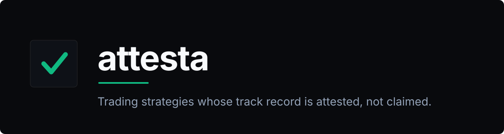

<div align="center">



<br>

[](https://ethglobal.com/events/ethonline2026)
[](docs/prizes.md#chainlink--cre-confidential-workflows)
[](docs/prizes.md#circle--agent-wallets-on-arc)
[](docs/prizes.md#privy--investor-wallets)
[](shared/types.ts)

</div>

---

Anyone can claim 40% APY. Copy-trading desks, signal groups and DeFi vaults all ask you to
trust a number published by the same party that profits from it — and the strategies with a
real edge won't show you their code, because publishing the parameters destroys the edge.
You get a choice between unverifiable claims and nothing at all.

**attesta removes the choice.** A creator uploads a TypeScript trading strategy. It is
compiled, registered on-chain, and run inside a hardware-isolated TEE as a Chainlink CRE
Confidential Workflow. Every trade and every performance figure leaves that enclave signed.

- **A creator cannot swap the script** after building a track record — the workflow hash is
  the strategy's identity, and it would change.
- **The platform cannot inflate returns** — it does not sign the performance record. The
  enclave does.
- **Parameters stay private** — they are encrypted in the creator's own browser before they
  ever reach us, and there is no read-back API. The code is open; the tuning is not.

Investors sign in with Privy, browse strategies, and allocate USDC. It reads like a passive
fund — except the numbers are attested rather than asserted.

## Architecture

Three layers, each with a single owner.

| Layer | Technology | Responsibility |
|---|---|---|
| **Compute** | Chainlink CRE Confidential Workflows | Strategy logic and risk guardrails execute inside the TEE. Secrets come from the Vault DON. Signed reports leave the enclave. |
| **Settlement** | Circle Agent Wallets on Arc | One policy-capped USDC wallet per strategy instance — spend limits, contract and chain allowlists. |
| **Distribution** | Privy | Investor onboarding: social login, embedded wallet, funding, allocation, withdrawal. |

Investors get Privy wallets; strategies get Circle Agent Wallets. That is deliberate, not
redundant — investors are humans who need consumer onboarding, strategies are autonomous
agents that need programmatic, policy-capped ones.

## The value loop

No performance figure is written by hand. APY is not a field — it falls out of the
strategy's own decisions applied to a price series:

```
price oracle (seeded, deterministic)
  -> GET /api/oracle/prices        [real HTTP call, made from inside the workflow]
  -> cre workflow simulate         [the strategy's onTick() returns target weights]
  -> backend prices the decision   [weights x price delta since last tick = pnl]
  -> vault.applyPnl(int256)        [real transaction on-chain]
  -> NAV snapshot
  -> APY / total return / drawdown [computed from the NAV series]
```

A strategy that picks badly shows a negative APY because it lost money, not because a
fixture says `-8.4`.

## Quickstart

Requires Node 22+, [Foundry](https://book.getfoundry.sh/getting-started/installation) and
the [CRE CLI](chainlink/SETUP.md).

```bash
git clone https://github.com/SauravKanchan/attesta.git
cd attesta
cp backend/.env.example backend/.env
cp frontend/.env.example frontend/.env    # set NEXT_PUBLIC_PRIVY_APP_ID

./scripts/dev.sh                          # anvil + contracts + backend:4000 + frontend:3000
```

`dev.sh` brings the whole local stack up and tears every process down together on exit.
Then open <http://localhost:3000>.

Useful while developing:

```bash
npm run seed        --prefix backend   # publish demo strategies and run a few ticks
npm run tick        --prefix backend -- <slug>   # drive a single scheduler tick by hand
npm run verify:loop --prefix backend   # prove the whole loop: publish, deposit, 4 ticks, metrics
npm test            --prefix backend
```

## Repo layout

```
contracts/    Foundry — MockUSDC, StrategyVault, StrategyRegistry
backend/      Fastify + Drizzle + better-sqlite3 + viem — API, scheduler, sanity pipeline
frontend/     Next.js 15 (App Router) + Tailwind v4 — marketplace, strategy editor, portfolio
chainlink/    CRE workflows — the strategy runner and the creator template
shared/       types.ts, strategy-contract.ts — the contract all three build against
```

[`shared/types.ts`](shared/types.ts) and
[`shared/strategy-contract.ts`](shared/strategy-contract.ts) are the machine-readable
contract every layer builds against.

## What is real, and what is not

A verifiability claim is only worth what its weakest link is, so this is stated plainly
rather than glossed.

| Piece | Status |
|---|---|
| Strategy decisions | **Real.** `cre workflow simulate` runs the actual workflow, which makes a real HTTP call to the price oracle. |
| Vault accounting, deposits, withdrawals, PnL | **Real transactions**, against a local anvil chain. |
| Performance metrics | **Derived** from NAV snapshots the scheduler wrote. Never hardcoded. |
| Browser-side signing | **Real.** The server never accepts a private key — sign-in is a challenge/verify signature exchange. |
| Creator secret encryption | **Real flow, dev cipher.** Encrypted in the browser before it leaves; the production path is TDH2 to the Vault DON's threshold key, swapped at one seam. |
| Live CRE confidential execution | **Blocked upstream.** Simulation passes and the workflow is deployed, but execution fails on Chainlink's side — see [SETUP.md](chainlink/SETUP.md#why-live-execution-fails). |
| Circle Agent Wallets | **Stood in for locally** by an anvil EOA as the vault operator; Agent Wallets have no local runtime. |
| Fiat onramp | **Mocked.** Privy's onramp routes through MoonPay, which does not support Arc testnet. |

Two honest limits on the trust model itself: the Agent Wallet is Circle-managed rather than
enclave-generated, so Circle is in the custody trust set; and Vault secrets are scoped to
the platform owner rather than to a single workflow, so isolation between creators rests on
every deployed workflow being enumerable and hash-checkable. Phase 1 also does not audit
strategy code — *verified* means "this exact code produced these results", not "this code is
safe".

The TEE is **AWS Nitro Enclaves in `us-west-2`** and nothing else.

## Docs

| Document | What's in it |
|---|---|
| [docs/project-overview.md](docs/project-overview.md) | The platform, the actors, the architecture, the verifiability model, phase 1 scope |
| [docs/build-plan.md](docs/build-plan.md) | The local implementation: contracts, API table, sanity pipeline, scheduler |
| [docs/prizes.md](docs/prizes.md) | The three partner technologies and the constraints each imposes |
| [docs/design/README.md](docs/design/README.md) | The design system and the factual constraints on UI copy |
| [chainlink/SETUP.md](chainlink/SETUP.md) | CRE setup, deployment status, and why live execution currently fails |
