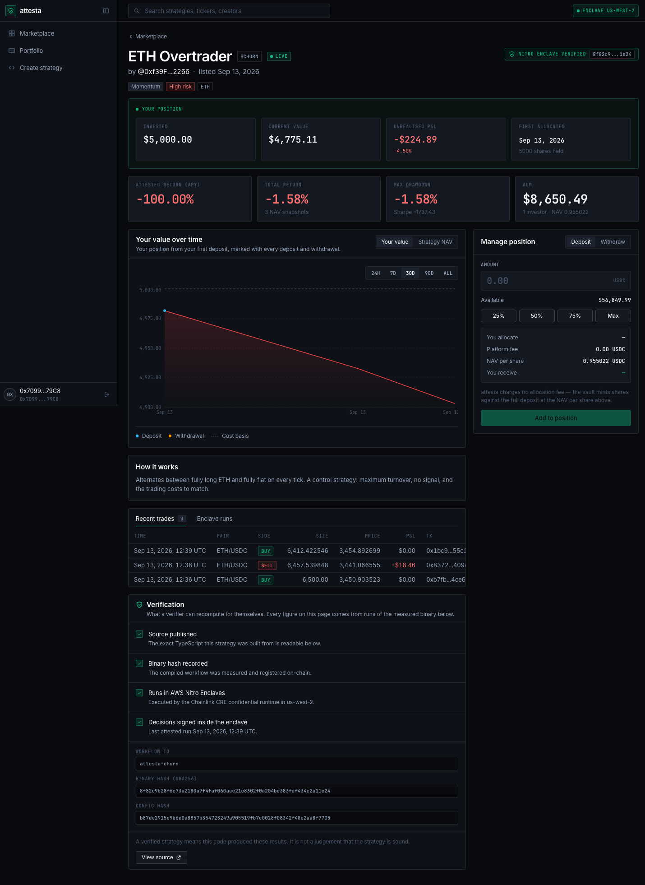

# attesta

**Trading strategies whose track record is attested, not claimed.**

Anyone can publish a trading strategy as TypeScript. attesta compiles it, measures the
binary, runs it inside an AWS Nitro enclave through Chainlink CRE, and settles each tick's
result into an on-chain vault. Investors allocate USDC against a performance record that
is *derived* from those runs — so every number on the page traces back to the exact binary
that produced it, and a creator cannot build a record on one strategy and quietly swap in
another.



> **Hackathon build (ETHOnline 2026).** Everything runs locally against an anvil chain on
> `31337`. No testnet, no mainnet, no real funds. The
> [boundary between what is real and what is a local stand-in](docs/demo.md#5-the-boundary-in-a-table)
> is written down rather than blurred.

---

## Why it exists

A strategy marketplace has one hard problem: the track record is a claim, published by
whoever profits from it. Audits do not fix it, because the audited code and the running
code are different things.

A TEE does fix it. The strategy's identity is the hash of its compiled workflow binary; it
runs inside an enclave nobody — creator, platform, or node operator — can reach into; and
the decisions it makes are what move the vault. Verification is therefore mechanical:
rebuild the published source, hash the binary, compare it with what is registered on
chain.

The same enclave keeps the creator's *parameters* private, so a strategy can prove its
record without publishing its edge. Code is open; thresholds are not.

## The three layers, and what is actually wired

The architecture has three layers. Be clear about which of them exist in this repo today —
[docs/prizes.md](docs/prizes.md) is the authority, and it marks the Circle layer as not
implemented.

| Layer | Running in this build | The production shape |
|---|---|---|
| **Compute** | **Chainlink CRE, for real.** Each strategy is generated as a confidential workflow whose cron handler is registered with `cre.handlerInTee(..., [{ tee: 'nitro', regions: ['us-west-2'] }])`. It reads its parameters through the Vault DON API, fetches prices over the enclave's own HTTP client, and crosses back to the DON to sign the decision. Exercised through `cre workflow build` and `cre workflow simulate`. | The same workflow deployed to the Workflow DON, scheduled by its cron trigger. Live execution is currently blocked by a Chainlink-side regression — [chainlink/SETUP.md](chainlink/SETUP.md). |
| **Settlement** | A `StrategyVault` per strategy on a local anvil chain, denominated in a 6-decimal MockUSDC. The vault's `operator` — the account that settles a tick — is an anvil EOA the backend funds and holds the key for. | Circle Agent Wallets on Arc, policy-capped and directed from inside the enclave. **Designed for, not built.** |
| **Distribution** | **Privy, for real.** Signing in means email, Google, a passkey or a connected wallet; Privy provisions an embedded wallet, and that wallet signs the server's nonce to sign in and signs every approve, deposit and withdrawal itself. It is the only way in — the backend never receives a key, never signs for a user, and has no endpoint that would accept one. | The same wallet against a public chain rather than local anvil. |

The distinction that matters: the enclave layer — the one the whole verifiability claim
rests on — is real. The other two are local stand-ins written behind a single seam each,
and the code says so where it stands in.

## How a number gets onto the page

Nothing about performance is stored as an input. It falls out of the strategy's own
decisions applied to a price series:

```
price oracle (seeded deterministic walk, backend)
   -> GET /api/oracle/prices        [real HTTP call, made from inside the enclave]
   -> cre workflow simulate         [the strategy's onTick() runs, returns target weights]
   -> backend prices the decision   [weights x price delta since the last tick = pnl]
   -> vault.applyPnl(int256)        [a real transaction on anvil]
   -> NAV snapshot                  [a row in nav_snapshots]
   -> APY / total return / drawdown [computed from the NAV series]
```

A strategy that picks badly shows a negative return because its weights lost money, not
because a column says so. A strategy nobody has ticked shows `—`, not zero.

## Layout

```
contracts/    Foundry — MockUSDC, StrategyVault (one per strategy), StrategyRegistry
backend/      Fastify + Drizzle + better-sqlite3 + viem — API, submission pipeline, tick loop
frontend/     Next.js 15 (App Router) + Tailwind v4 — marketplace, strategy detail, portfolio, create flow
chainlink/    The CRE workflow template, the strategy toolkit, and the example strategies
shared/       types.ts and strategy-contract.ts — the contract all three build against
docs/         Design intent, architecture, and the demo runbook
```

## Run it

Full instructions, including what to expect at each step, are in
**[docs/demo.md](docs/demo.md)**. The short version, in four terminals:

```bash
# 1  the chain
anvil --host 127.0.0.1 --port 8545 --chain-id 31337 --block-time 2

# 2  the contracts (once per anvil)
cd contracts && ./deploy-local.sh

# 3  seed the marketplace — publishes three strategies through the real pipeline, ~3 min
cd backend && npm run seed

# 3  (same terminal, once the seed has finished) the API and the tick loop
cd backend && npm run dev        # http://localhost:4000

# 4  the UI
cd frontend && npm run dev       # http://localhost:3000
```

Sign in with an anvil test account — the login screen lists them — and press **Add funds**
on the portfolio page for test USDC.

First run only: `cd contracts && forge install`, and
`bun install --cwd chainlink/strategy-runner` (the dependency set every generated workflow
links against). Needs node ≥ 22, foundry, bun ≥ 1.2.21 and the CRE CLI on `PATH`.

`npm run seed` publishes but does not tick, so a freshly seeded marketplace has no
performance history — [give it one](docs/demo.md#2-give-the-demo-a-track-record--do-this-before-you-record)
before demoing it.

## Check it yourself

```bash
cd contracts && forge test            # 47 tests, including 4 vault invariants
cd backend   && npm test              # 116 tests — share math, metrics, tick pricing
cd backend   && npm run verify:loop   # the whole loop end to end, against its own database
```

`verify:loop` is the honest one: it publishes an example strategy through the real
pipeline, checks the registry anchor is readable back under the id publish computed, ticks
once with no depositors to prove settlement is skipped rather than faked, takes a real
deposit, ticks three more times, and computes APY from the resulting NAV series. Nothing
in it is stubbed, and it takes minutes because each tick really compiles the strategy to
WASM and runs it in the enclave simulator.

## Docs

| File | What it covers |
|---|---|
| [docs/demo.md](docs/demo.md) | Bringing the stack up from cold, the demo click-path, the video script, and the local-vs-production boundary |
| [docs/project-overview.md](docs/project-overview.md) | The actors, the verifiability model, the creator submission flow, and phase 1 scope |
| [docs/build-plan.md](docs/build-plan.md) | The local implementation: contracts and their edge cases, auth, the API table, the sanity pipeline, the scheduler |
| [docs/prizes.md](docs/prizes.md) | The three partner technologies and the constraints each imposes |
| [docs/design/README.md](docs/design/README.md) | The design system, and the factual constraints on UI copy |
| [chainlink/SETUP.md](chainlink/SETUP.md) | CRE setup, the confidential path, and why live execution currently fails |
| [contracts/README.md](contracts/README.md) | The three contracts and their invariants |

## Honest limits

- **The enclave path is proven in simulation, not in a deployed workflow.** Every live
  execution on the `zone-a` DON fails with `DON members not set`, a platform-side
  regression other teams hit at the same hour. `cre workflow simulate` runs the same
  `handlerInTee` code path locally and is what the demo shows.
- **Locally, secrets are encrypted with a `local-dev` scheme**, not TDH2 to the Vault DON.
  The key never leaves the creator's browser, which reproduces the platform's ignorance of
  the plaintext — but no enclave can read them either, so strategies fall back to their
  documented defaults. `EncryptedSecret.scheme` is the seam.
- **Circle Agent Wallets on Arc are not implemented.** A strategy settles through an anvil
  EOA that the backend funds and holds the key for. It sits behind a seam meant for the
  real thing (`ChainPort`) and is not dressed up as the real thing anywhere in the UI. The
  investor half *is* real: Privy's embedded wallet is the only signer the browser has.
- **A verified strategy means "this exact code produced these results".** It is not a
  judgement that the strategy is sound. Phase 1 does not audit uploaded code.
- **Performance figures are minutes old on a local chain.** Annualising a few minutes of
  NAV history produces absurd APYs; total return and the NAV series are the numbers to
  read.
- **The vault does not trade.** A tick's outcome is decided in the enclave and settled
  as one signed delta, so share value tracks realised performance without the vault
  holding positions.
