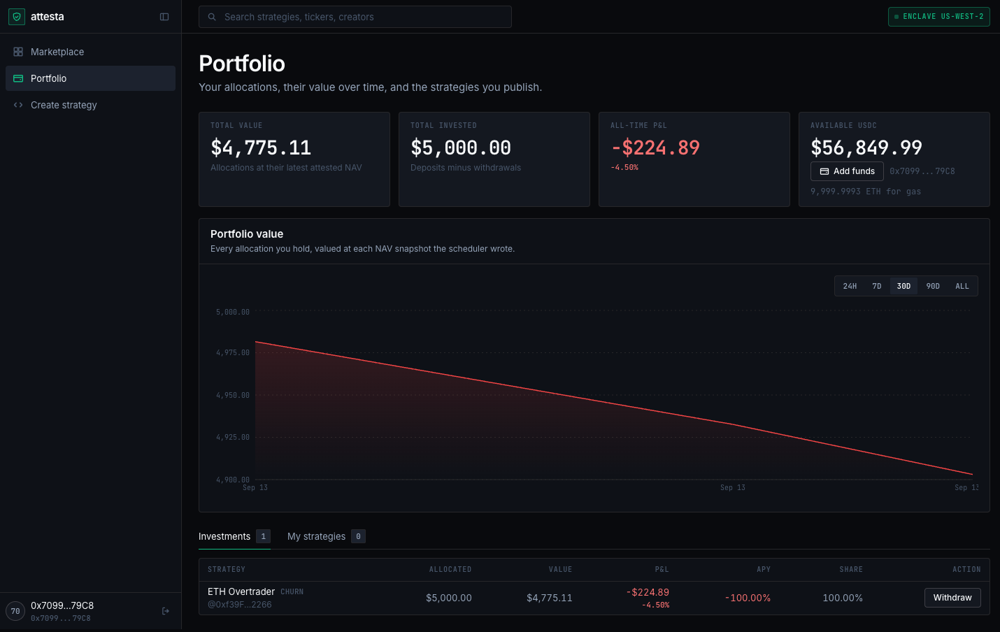

# Demo runbook

Everything below was run on this machine against a local anvil chain. No testnet, no real
funds, no external service in the money path.

Read [build-plan.md](build-plan.md) for how the pieces fit together. This file is only
about getting the stack up, giving it something to show, and recording it.

---

## 0. What you need installed

| Tool | Version here | Why |
|---|---|---|
| node | v22.16.0 | backend and frontend |
| foundry (`anvil`, `forge`, `cast`) | 1.0.0-stable | the local chain and the contracts |
| bun | 1.4.2 | the CRE toolchain compiles TypeScript → JS → WASM through bun. **Must be ≥ 1.2.21** or the WASM traps at engine start with an opaque `wasm unreachable` error |
| CRE CLI | v1.33.0, at `~/.cre/bin/cre` | `cre workflow build` and `cre workflow simulate` |

`cre workflow build` and `cre workflow simulate` run entirely locally — no CRE login, no
deploy access, no network round trip to Chainlink is needed for the demo.

Two dependency sets must exist before the first strategy compiles, and neither is in git:

```bash
cd contracts && forge install                      # foundry libs
bun install --cwd chainlink/strategy-runner        # the dependency set every generated workflow links against
```

If `chainlink/strategy-runner/node_modules` is missing, every `cre workflow build` fails
and no submission can pass check 8.

---

## 1. Bring the stack up from cold

Four terminals. Do them in this order — the seed has to run while the backend is *not*
holding the database, because it deletes it first.

**Terminal 1 — the chain.** Leave it running for the whole demo.

```bash
anvil --host 127.0.0.1 --port 8545 --chain-id 31337 --block-time 2
```

**Terminal 2 — the contracts.** Once per anvil.

```bash
cd contracts && ./deploy-local.sh
```

Writes `contracts/deployments/local.json`, the address book everything else reads:

```json
{
  "chainId": 31337,
  "deployer": "0xf39Fd6e51aad88F6F4ce6aB8827279cffFb92266",
  "registry": "0xe7f1725E7734CE288F8367e1Bb143E90bb3F0512",
  "usdc": "0x5FbDB2315678afecb367f032d93F642f64180aa3"
}
```

**Terminal 3 — seed the marketplace.** Takes roughly six minutes and prints its progress.

```bash
cd backend && npm run seed
```

This is not a fixture dump. It signs in over the same challenge/verify exchange the
browser uses, POSTs three submissions, runs all nine sanity checks including a real
`cre workflow build` and a real `cre workflow simulate`, deploys a `StrategyVault` per
strategy, prefunds 250,000 USDC into each vault's reserve, and anchors each one in the
`StrategyRegistry`. It finishes by giving the marketplace a track record — a real
deposit and three enclave ticks, §2 — so what it hands you is recordable rather than
merely correct. It wipes `backend/data/attesta.db` and the workflow workspace first, and
it briefly binds port 4100 for its own server.

You end up with three live strategies:

| Slug | Name | Ticker | Risk |
|---|---|---|---|
| `mom` | ETH Momentum | MOM | medium |
| `rev` | ETH Mean Reversion | REV | low |
| `churn` | ETH Overtrader | CHURN | high |

The slugs come from the tickers, not the template file names — the URLs are
`/strategy/mom`, `/strategy/rev`, `/strategy/churn`.

**Terminal 3 — the backend**, once the seed has finished.

```bash
cd backend && npm run dev        # http://localhost:4000
```

The tick loop starts with it: one tick per live strategy every 60 s, three at a time.

**Terminal 4 — the frontend.**

```bash
cd frontend && npm run dev       # http://localhost:3000
```

### Check it is actually up

```bash
curl -s localhost:4000/api/health                      # {"status":"ok","database":"ok",...}
curl -s localhost:4000/api/chain/config                # chain id, rpc url, usdc and registry addresses
curl -s 'localhost:4000/api/strategies' | head -c 200  # three strategies
```

Two settings have to agree or the UI comes up blank with CORS errors in the console:
`NEXT_PUBLIC_API_URL` in `frontend/.env` must point at the backend (`http://localhost:4000`)
and `CORS_ORIGIN` in `backend/.env` must be the frontend's origin
(`http://localhost:3000`). Check both before recording — they are easy to leave pointing
somewhere else after a debugging session.

### Do not redeploy after seeding

`StrategyVault` stores its USDC address as an `immutable`. Re-running
`contracts/deploy-local.sh` — or `scripts/dev.sh`, which calls it — deploys a *new*
MockUSDC and rewrites the address book, while the seeded vaults still point at the old
token. The marketplace then looks fine and every deposit fails.

Restarting anvil is worse: the seeded vault addresses have no code at all.

**If you restart anvil or redeploy, re-seed.** `scripts/dev.sh` brings up anvil,
contracts, backend and frontend in one command, but it always redeploys, so it is the
right tool for a fresh empty stack and the wrong tool for one that is already seeded.

---

## 2. The track record, and how to add to it

Publishing a strategy is not enough to look at. Two things have to happen before the story
lands:

1. **Somebody has to deposit.** `applyPnl` reverts `NoSharesOutstanding()` when
   `totalShares == 0`, so with no depositors the tick still runs and still writes a NAV
   snapshot, but there is no settlement and NAV never moves.
2. **The strategy has to tick.** The green **Nitro enclave verified** badge appears only
   once an execution row exists whose decision came from `cre workflow simulate` — the
   backend records the decision source per tick and only the enclave path counts. A
   fallback decision taken in-process is never dressed up as an attested run.

**`npm run seed` now does both for you,** as its last phase, so a cold seed comes up
record-ready: it signs in as anvil account #1, takes 5,000 USDC from the faucet, signs
`approve` and `deposit` with that account's own key, records the deposit through
`POST /strategies/churn/invest` against the receipt, and then ticks `churn` three times
through the enclave. Tail of a real run:

```
── track record: churn ──────────────────────────
  investor        0x70997970C51812dc3A010C7d01b50e0d17dc79C8
  approve         0x7c4fa31bb73c5854a81085446fd4df3182f9e44fa252ecaf6006728c29816901
  deposit         5000.000000 USDC -> 5000.000000 shares (tx 0x9cb7cbaf8100696a4d207c17ea990ed1f4166c85bc97a511ea7bed619928997d)
  position        5000.000000 shares, cost basis 5000.000000 USDC
  tick 1/3         ok  via cre-simulate  ENTER  navPerShare 0.997000
  tick 2/3         ok  via cre-simulate  EXIT  navPerShare 0.994386
  tick 3/3         ok  via cre-simulate  ENTER  navPerShare 0.991403
```

Which leaves `churn` on **return since inception −0.56%**, 4,957.02 USDC of AUM, one
investor, a three-point NAV chart and a green badge — and leaves `mom` and `rev` amber,
which is the contrast worth pointing at on camera.

The knobs, all optional: `SEED_DEMO_SLUG` (default `churn`), `SEED_TICKS` (3),
`SEED_MAX_TICKS` (12), `SEED_DEPOSIT_USDC` (5000), `SEED_INVESTOR_KEY` (anvil #1).
`SEED_TRACK_RECORD=false` publishes and stops, which is the right thing when you only want
the pipeline to run.

`SEED_MAX_TICKS` is the ceiling on the extra ticks the phase will take while NAV has not
moved. A strategy that is out of the market settles `applyPnl(0)` — a real tick that leaves
NAV byte-identical — and a run made only of those reads on the card exactly like a strategy
that never ran, so the phase keeps going until something settles.

**To add to a record that already exists** — a second strategy ticked, or a database that
went flat after an anvil restart and a re-seed — run the same phase on its own. It binds
the API port for the duration, so stop the backend first:

```bash
cd backend && SEED_DEMO_SLUG=mom SEED_TICKS=1 npm run seed:track-record
```

### Driving ticks by hand

You do not need this to record, but a terminal ticking a strategy live is the single best
shot in the video. Run the backend with its own loop switched off first, so that two
processes are not settling the same vault from one operator nonce:

```bash
# terminal 3, instead of plain `npm run dev`
cd backend && SCHEDULER_ENABLED=false npm run dev

# terminal 5
cd backend && npm run tick -- churn --repeat 3 --gap 30
```

The backend still has to be running even when you drive the ticks yourself: the strategy
fetches its prices over HTTP *from inside the enclave*, and `GET /api/oracle/prices` is
what answers. A tick against a stopped backend produces no decision at all.

Real output from that command on this machine:

```
── tick churn ─────────────────────────────────────
  status        ok
  source        cre-simulate
  action        ENTER  flipping long
  weights       {"ETH":10000}
  pnl computed  -19.500000 USDC
  pnl applied   -19.500000 USDC
  applyPnl tx   0xff17061d162e13b1bf8d3115db2dd9794eb2e336c602f02a8e144454b8509788
  trade txs     0xb7fb671abdaa2f5c714d45e928fdf6f4a94cb58bfeed4c8b1b869ec031fe4ce6
  navPerShare   0.996307
  totalAssets   6476.000000 USDC
  totalShares   6500.000000
  duration      26.6s
    | ✓ Workflow compiled
    | Binary hash: 8f82c9b28f6c73a2180a7f4faf060aee21e8302f0a204be383fdf434c2a11e24
    | │     - AWS Nitro in us-west-2                                                    │
    | 2026-09-13T18:06:00Z [USER LOG] attesta-decision:{"action":"ENTER","targetWeightsBps":{"ETH":10000},"reason":"flipping long"}
    | ✓ Workflow Simulation Result:
```

That is the whole value loop in one screen: the strategy's compiled binary, the enclave
line, the decision the strategy returned, the on-chain settlement, the new NAV per share.
It is worth having this terminal visible during the recording.

A tick takes 25–90 s, dominated by `cre workflow simulate`. Three ticks with a 30 s gap is
about three minutes.

**Why `churn` is the one the seed funds.** `mom` and `rev` mostly HOLD on the seeded price
walk, which means a flat NAV and no trades. `churn` (the overtrader) flips its whole book
every tick, so it produces trades, pays the 30 bps venue cost on turnover, and moves NAV.
Tick the other two by all means, but lead with this one.

### APY reads as unavailable, and that is the point

The card leads with **return since inception**, and the APY tile shows a dash with the hint
*"Not enough NAV history to annualise yet"*. That is deliberate, not a gap.

Annualising a twenty-minute observation is not a projection, it is an artefact: compound a
small loss over a year and every strategy saturates to exactly −100%, compound a small gain
and you get numbers like 9.9e106. So the metrics refuse to annualise below a six-hour
window and report `null` instead, and the card falls back to the figure that is honest at
any span.

Return since inception separates the strategies cleanly — one down 1.4%, another down
13.4% — which the saturated annualisation did not.

**Say this out loud, it is one of the better lines in the demo:**

> "It won't show you an APY yet. This track record is twenty minutes old, and annualising
> twenty minutes gives you a number that means nothing. It shows return since inception
> instead, because that one is true. A marketplace that prints a confident APY over a
> twenty-minute history is telling you something it cannot know."

That reframes the strongest objection to the whole category — *anyone can claim 40% APY* —
as something the product actively refuses to do. Do not apologise for the dash.

**Do not try to tick your way to an APY before recording.** Clearing the six-hour floor
gets you a number, not a trustworthy one: a year is 1460 six-hour windows, so the exponent
still saturates. Measured against the seeded run, replayed over exactly six hours, all
three strategies report **−100.00% APY** — `churn` at Sharpe −195, `mom` at −67.51, `rev`
at −12.60 — while their honest returns over the same series are −27.76%, −7.57% and
−1.23%. The floor postpones the artefact; it does not remove it. The annualisation only
stops saturating at roughly a month of NAV history, which no demo is going to accumulate.

So the dash is not a state to escape before recording. It is the state to record.

---

## 3. The click path

The demo investor is whoever signs in through Privy. There is no key to paste and none to
read out on camera: Privy creates an embedded wallet for the account you sign in with, and
attesta funds that address from the deployer on the first sign-in.

The seeded track record is a separate, pre-existing position held by anvil account #1
(`0x70997970C51812dc3A010C7d01b50e0d17dc79C8`), written server-side by `npm run seed` — it
is what gives `churn` a curve before you touch anything, not an account you sign in as.

**1. Landing — http://localhost:3000**
Public, no session. "Performance you can verify instead of performance you're told about."
Click **Browse strategies**.

**2. Sign in — /login**
Click **Sign in with Privy** and finish in Privy's modal — email, Google, a passkey, or a
wallet you already hold.
What happens: Privy provisions an embedded wallet and hands over its address,
`POST /auth/challenge` returns a nonce and a SIWE-style message, the embedded wallet signs
it, `POST /auth/verify` recovers the signer and issues a session. No key crosses the wire;
the API has no endpoint that would take one. attesta then calls the faucet so the new
wallet has gas and USDC before you reach the marketplace.

The login screenshots under `screenshots/` still show the removed pasted-key screen and
need reshooting against the Privy sign-in.

**3. Marketplace — /**
Three cards. Each one carries a live verification badge and the first bytes of its binary
hash. After §2 you should see **Nitro enclave verified** in green on the strategies you
ticked and **Awaiting attestation** in amber on the ones you did not — that contrast is
worth pointing at, because it shows the badge tracks real runs.

**4. Strategy detail — click ETH Overtrader**
Everything on this page comes from the API; nothing is written by hand.

- Four stat tiles: **Attested return (APY)**, **Total return**, **Max drawdown**, **AUM**.
- A performance chart with two views — **Strategy NAV** (NAV per share over the snapshot
  series) and **Your value** (your own money, once you hold a position), with your
  deposits and withdrawals marked on it.
- **Verification** panel — four links a verifier can check: source published, binary hash
  recorded, runs in AWS Nitro Enclaves (us-west-2), decisions signed inside the enclave,
  each with the timestamp of the last attested run. Below them the copyable **binary
  hash**, **config hash** and **workflow id**.
- **Activity**, two tabs: **Recent trades** (pair, side, size, price, pnl, tx hash) and
  **Enclave runs** (action, reason, pnl applied, the `applyPnl` tx hash, duration). Every
  hash is a real transaction on anvil; `cast tx <hash>` resolves it.
- Click the verification badge itself for the proof drawer, which spells out how to
  recompute the measurement.


**5. Source — "View source"**
The exact TypeScript the binary was built from. This is the other half of the hash claim:
rebuild this file, hash the WASM, compare.

**6. Portfolio — /portfolio**
Click **Add funds** under *Available USDC*. `POST /wallet/faucet` mints 10,000 MockUSDC to
the signed-in address and tops its gas up if needed. Real response:

```json
{"walletAddress":"0x70997970C51812dc3A010C7d01b50e0d17dc79C8","minted":"10000.000000",
 "mintTxHash":"0x7826628cea8efb973b00c3d9a53ce033421e5672934fbf27758eb6124000c1e9",
 "usdcBalance":"61849.992296","gasBalance":"9999.999395074995765525"}
```

**7. Allocate — back on the strategy page**
Type an amount (5,000 is a good round number), press **Allocate USDC**. The browser sends
two transactions it signs itself — `usdc.approve(vault, amount)` then
`vault.deposit(amount)` — waits for the receipt, and only then posts the hash to
`POST /strategies/:slug/invest`. The backend fetches that receipt, parses the `Deposited`
event, checks it came from the caller and targets this strategy's vault, and records the
position from what the chain says rather than from anything the client claims. A forged or
replayed hash records nothing.

**8. Watch a tick land**
Either wait for the 60 s loop or run the `npm run tick` command from §2 with the terminal
on screen. Refresh the strategy page: a new NAV point, a new execution row, new trades,
and your position's value has moved.

**9. Portfolio again**
The **Investments** tab shows the position — allocated, value, P&L, APY, share — and the
portfolio value chart values every allocation at each NAV snapshot the scheduler wrote.
**Withdraw** redeems shares through the same browser-signed, receipt-verified path.



**10. Create a strategy — /create** (optional; it is the slowest part of the demo)
Three steps: **Code** (the editor is pre-filled from
`chainlink/templates/strategy.template.ts`), **Private parameters** (encrypted in the
browser before anything is sent), **Review & publish** (**Run pre-flight checks** streams
the nine checks; **Publish strategy** unlocks only when all nine pass).

The nine checks, in order: parses → required exports → forbidden imports → no side
effects → typechecks → describe valid → deterministic → `cre workflow build` →
`cre workflow simulate`. The last two are real CLI invocations and take about a minute
between them, which is dead air on camera — pre-run this once so the workspace is warm, or
narrate over it, or cut it.

---

## 4. Video script — 3 to 4 minutes

The argument, in the order that makes it. Lead with what is novel; the feature tour is the
evidence, not the pitch.

### Beat 1 — the claim (0:00–0:25)

*On screen: the landing page.*

> Every trading strategy marketplace has the same problem: the track record is a claim.
> The platform tells you a number and you decide whether to believe it. attesta makes the
> track record checkable. A strategy is TypeScript, its identity is the hash of the
> compiled binary, and the number you see was produced by a run of that exact binary.

### Beat 2 — a strategy is code, and its identity is a hash (0:25–1:05)

*On screen: strategy detail → "View source" → back to the Verification panel.*

- This is the whole strategy: a TypeScript file exporting `describe()` and `onTick()`.
- The platform compiles it to WASM and measures it. That binary hash — point at
  `8f82c9b2…a11e24` — *is* the strategy's identity.
- It is anchored on-chain in the registry under `keccak256(strategyId)`, alongside the
  vault address.
- Change one character of the source and the hash changes, so it becomes a different
  strategy with a fresh track record. A creator cannot build a record on a winner and
  swap the code underneath it.

### Beat 3 — it runs in a real enclave, and you can watch it (1:05–1:55)

*On screen: the terminal running `npm run tick -- churn`.*

- The workflow's cron handler is registered with `cre.handlerInTee(..., [{ tee: 'nitro',
  regions: ['us-west-2'] }])`. When the trigger fires, the Workflow DON hands execution to
  an AWS Nitro enclave instead of running the callback on a node.
- Point at the simulator output: **AWS Nitro in us-west-2**, then the `[USER LOG]` line
  carrying the decision the strategy returned —
  `{"action":"ENTER","targetWeightsBps":{"ETH":10000},"reason":"flipping long"}`.
- Inside the enclave the strategy reads its parameters through `runtime.getSecret()` —
  the Vault DON API — and fetches prices over the enclave's own HTTP client, so the data
  the decision is made on stays confidential from node operators. Only the action and the
  reason cross back to the DON to be signed.
- Say the boundary out loud: **this is `cre workflow simulate`, the CRE CLI's local
  enclave path, not a deployed workflow.** Live deployment is blocked on a Chainlink-side
  regression — every execution on `zone-a` fails with `DON members not set` — which is
  documented in `chainlink/SETUP.md` and which other teams hit at the same hour. The
  enclave path demonstrably works; what is missing is somebody else's DON config.

### Beat 4 — the platform cannot read the creator's parameters (1:55–2:30)

*On screen: /create, step 2, typing a parameter value.*

- Thresholds and position sizes are what a creator actually owns. They are encrypted in
  the creator's own browser before anything is sent; the backend stores ciphertext in a
  table with no plaintext column, and `POST /submissions/:id/secrets` accepts nothing else.
- In production that encryption is TDH2 to the Chainlink Vault DON's threshold key, and
  the plaintext is released only into an attested enclave. There is no read-back API —
  `cre secrets list` returns identifiers, not values — so holding the platform's owner key
  does not recover a secret.
- Locally the scheme tag is `local-dev`: AES-256-GCM with a key that never leaves the
  browser. The page says so. It reproduces the platform's *ignorance* of the plaintext,
  which is the claim, and not the enclave's *access* to it, which only the real Vault DON
  delivers. One function and one scheme tag change between the two.

### Beat 5 — therefore the performance record is checkable (2:30–3:15)

*On screen: strategy detail — NAV chart, executions, trades. Then the portfolio.*

- Nothing here is a stored number. Each tick: the enclave returns target weights, the
  backend prices those weights against the price series, sends `applyPnl(int256)` to the
  vault as a real transaction, and writes a NAV snapshot. APY, total return, drawdown and
  Sharpe are all computed from that NAV series.
- Every execution row carries the `applyPnl` transaction hash and every trade row its own
  hash. `cast tx <hash>` resolves them on the local chain.
- The badge says **Nitro enclave verified** only when the last decision came from the
  enclave path. The strategy nobody has ticked still says **Awaiting attestation** — the
  badge tracks runs, not intentions.
- Be first to say it about the APY: the card shows return since inception and the APY tile
  reads unavailable, because the product refuses to annualise a track record this young.
  That is the answer to "anyone can claim 40% APY" — this one declines to. The point is
  where the number comes from, not how big it is.
- The investor side is a browser-signed deposit: approve, deposit, and the backend records
  the position only after verifying the receipt on chain. It never holds a key and it
  never takes the client's word for a transfer.

### Beat 6 — what is real, and what is a local stand-in (3:15–3:45)

Do not blur this. Judges will ask, and the honest version is more convincing.

> Running locally against anvil: the strategy pipeline, `cre workflow build` and
> `cre workflow simulate` in the CRE CLI's Nitro path, the vaults, the registry anchor,
> the deposits and withdrawals, and every number on the screen.
>
> Standing in for production: the strategy operator is an anvil EOA where it would be a
> Circle Agent Wallet on Arc, the secret scheme is `local-dev` where it would be TDH2 to
> the Vault DON, and the backend owns the tick interval where a deployed workflow's cron
> trigger would.

Say the strong version of that rather than the soft one. **Circle Agent Wallets are not
implemented** — the settlement layer is a vault on a local chain, driven by an anvil EOA
behind the `ChainPort` seam, and it is not presented as the real thing anywhere in the UI.
The investor signer is not a stand-in: Privy's embedded wallet is the only way into the
app, and it signs the challenge and every transaction. What else is real is the layer the
whole claim rests on: the strategy compiled, measured and run through CRE's enclave path.

---

## 5. The boundary, in a table

Have this on hand for questions.

| Piece | Locally, right now | In production |
|---|---|---|
| Strategy language | TypeScript against `shared/strategy-contract.ts` | unchanged |
| Compilation & measurement | `cre workflow build`, binary hash captured from the CLI | unchanged, plus registration under the platform's CRE owner |
| Enclave execution | `cre workflow simulate`, the CLI's AWS Nitro / us-west-2 path, one cron fire per invocation | Workflow DON dispatches `handlerInTee` to the enclave on its own schedule |
| Scheduling | backend tick loop, 60 s, `SCHEDULER_ENABLED` | the DON's cron trigger |
| Creator parameters | encrypted in the browser, `local-dev` AES-256-GCM, key never leaves the tab; the enclave therefore reads an empty secret and each strategy falls back to its documented default | TDH2 to the Vault DON threshold key; released only into an attested enclave |
| Price data | seeded deterministic walk served by `GET /api/oracle/prices`, fetched *from inside* the simulated enclave over HTTP | a real venue or data feed over the enclave's confidential HTTP client |
| Strategy wallet | anvil EOA per strategy, funded by the deployer, `operator` on the vault | Circle Agent Wallet on Arc with a spending policy, directed from inside the enclave — **designed for, not built** |
| Investor wallet | Privy embedded wallet behind social login, signs the challenge and every transaction in the browser | unchanged — the same wallet against a public chain rather than local anvil |
| Settlement | `StrategyVault` on anvil, MockUSDC, 6 dp | USDC on Arc |
| Trades | `recordTrade` events priced off the oracle walk; the vault does not swap | real venue execution on Arc |
| Signed reports | `donRuntime.report(...)` runs in the simulator | consensus-signed reports from the DON |

Of the three partner technologies in the architecture, only **Chainlink CRE** is wired
into the running system. [prizes.md](prizes.md) is the authority on that and marks the
Circle layer as out of scope. Do not let the pitch imply otherwise — the enclave layer is
strong enough on its own, and a judge who catches an overclaim will discount the parts
that are true.

Claims that are **false for this system** and must not appear anywhere: Intel SGX,
MRENCLAVE, zk-STARKs or any zero-knowledge proof, and enclave quorum counts. It is AWS
Nitro Enclaves in us-west-2 and nothing else.

---

## 6. Troubleshooting

**Every card says "Awaiting attestation" and APY is `—`.**
No strategy has ticked yet — after a seed, `churn` should be green and only `mom` and
`rev` amber, so all three amber means the seed's track record phase was skipped or failed.
Its log line is the last thing `npm run seed` prints; `npm run seed:track-record` runs it
again on its own. See §2. One tick is enough for the badge, and two NAV
snapshots at any spacing are enough for total return and max drawdown — neither annualises
anything, so neither is gated on how long the series is. APY and Sharpe are the two that
are, and they stay `—` until the series spans `MIN_ANNUALISE_MS`
(`backend/src/lib/annualise.ts`). A dash there is the designed answer, not a fault to
chase: see §2.

**NAV never moves even though ticks succeed.**
Nobody has deposited, so `applyPnl` is skipped — the vault refuses to book a gain that has
no owner. Deposit first, then tick. `navPerShare` reads par (1.000000) whenever
`totalShares == 0`; that is not evidence of capital.

**`cre workflow build` fails or the simulate output has no decision.**
Check `bun --version` first — anything below 1.2.21 emits a broken WASM that traps at
engine start with `wasm unreachable`. Then check that
`chainlink/strategy-runner/node_modules` exists.

**Deposits fail after everything looked fine.**
Contracts were redeployed under the seeded database. Re-seed (§1).

**The frontend shows chain or CORS errors.**
`frontend/.env` must point `NEXT_PUBLIC_API_URL` at the backend you are actually running,
and the backend's `CORS_ORIGIN` must match the frontend's origin. Contract addresses are
never read from env — `GET /api/chain/config` is authoritative for those.

**A tick takes longer than the 60 s interval.**
Expected — a simulate can run 25–90 s. The loop skips a strategy whose previous tick is
still running rather than stacking two settlements into one NAV series, and logs
`previous tick still running; skipping this cycle`.

**Two things are ticking the same strategy.**
Do not run `npm run tick` against the same database while `npm run dev`'s scheduler is
live on the same strategy — the vault's operator would sign two transactions from one
nonce. Either let the loop run, or start the backend with `SCHEDULER_ENABLED=false` and
drive the ticks by hand.

**A page renders empty with `request failed validation` in the console.**
A query parameter is out of the range the route accepts. The response body names the field
and the bound; `curl` the same URL to see it.

---

## 7. Reset

```bash
cd backend && npm run seed     # wipes the db and the workspace, re-publishes all three, re-funds and re-ticks churn
```

If anvil has been restarted, redeploy the contracts first (`cd contracts &&
./deploy-local.sh`), then seed. Seeding always deploys fresh vaults at fresh addresses,
so any address written down from a previous run is dead.
